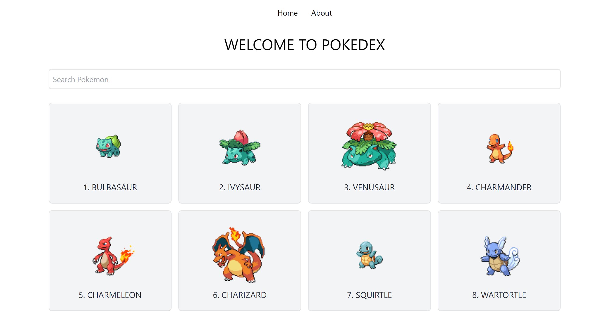

# Benz Blog

[View Live Site](https://benz-pokedex.netlify.app/)

A smple SvelteKit project lists all pokemon with PokeAPI.

## Features

- Prerender Home page and SSR Pokemon details page.
- Search functionality with cool Svelte built-in animation.
- Implement the new directory-based routing instead of file-based routing.

## Preview

## Tech stack

- [SvelteKit](https://kit.svelte.dev/)
- [TailwindCSS](https://tailwindcss.com/)
- [PokeAPI](https://pokeapi.co/)
- [Vite](https://vitejs.dev/)

## Show your support

Give a ⭐️ if you like this project!

## License

[MIT](LICENSE)
